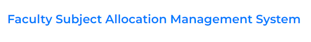
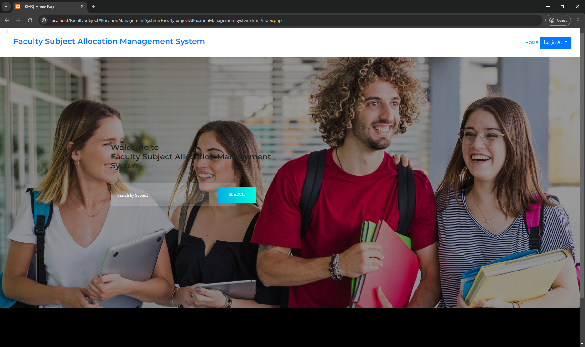
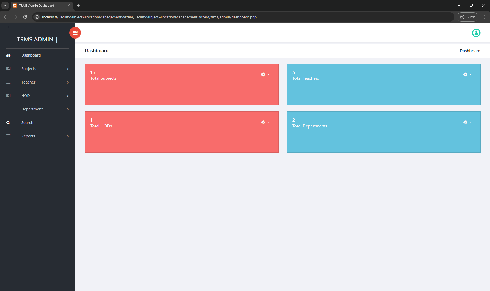

# SD-3101 Faculty Subject Allocation Management System



## Table of Contents
- [Introduction](#introduction)
- [Project Overview](#project-overview)
- [Objectives](#objectives)
- [Features](#features)
- [Technologies Used](#technologies-used)
- [Setup and Installation](#setup-and-installation)
- [Usage Instructions](#usage-instructions)
- [Project Structure](#project-structure)
- [Contributors](#contributors)
- [Chagelog](#changelog)
- [Acknowledgments](#acknowledgments)
- [License](#license)

---

## Introduction
    In Faculty Subject Allocation Management System we use PHP and Mysql database. 
    This is the project which keep records of Teachers where teachers can enter priority to the subjects they prefer to teach. This data is sent to the hod who allots subjects to the faculty. 
    Faculty Subject Allocation Management System has four module i.e. admin, faculty, hod and users.

## Project Overview
    The Faculty-Subject Allocation Management System is designed to streamline the process of assigning subjects to faculty members in educational institutions. Built using PHP and MySQL, the system enables efficient management of teachers' preferences for subjects, allowing the Head of Department (HOD) to allocate subjects based on those preferences. The system consists of four key modules: Admin, Faculty, HOD, and Users.

Background/Context:
    The project addresses the challenge of manually managing subject allocations in schools and colleges, aiming to automate and optimize this process for administrators.

Target Audience/Users:
    - Admin: Manages teachers, HODs, and subjects.
    - HOD: Allocates subjects to faculty.
    - Faculty: Submits preferences for subjects.
    - Users: Can search for teachers based on subjects.

Real-World Applications and Impact:
    This system reduces administrative burden, enhances fairness in subject allocation, and improves communication between faculty and administration. It can be  applied in schools, colleges, and universities to ensure that subject assignments are aligned with faculty expertise and preferences.

## Objectives
    - Develop a solution for streamlining the subject allocation process by automating faculty preferences and HOD assignments.
    - Implement features to allow faculty to prioritize subjects and HODs to allocate them efficiently based on these preferences.
    - Test and validate the accuracy, security (using MD5 encryption), and usability of the system for admins, faculty, and HODs.

## Features
Admin Module
1.	Dashboard: In this section admin can briefly view total number of subjects and total number of teachers.
2.	Subjects : In this section, admin can manage the Subjects (add/update).
3.	Teachers : In this section, admin can add new teachers and manage the details of old teachers.
4.	HOD : In this section, admin can add new HOD's and manage the details of old HOD's.
5.	Search: In this section, admin can search teachers by using teacher or HOD's name.
6.	Report: In this section, admin can view number of teachers or HOD's added  in particular periods.
7.	Profile: In this section admin can update his/her profile.
8.	Change Password: In this section admin can change his/her  own passwords
9.	Logout: Through this button admin can logout.
10.	Forgot Password : In this section, admin can receive his/her password by using registered email id and contact number.
Admin can also recover his/her password

Note: Only admin can add/delete faculty and Hod.They cannot register by themselves. 

Faculty Module
1.	Dashboard: In this section faculty can briefly view total number of subjects .
2.	Subjects : In this section, faculty can enter the priority (add/update) and can also view the alloted subjects.
3.	Profile: In this section faculty can update his/her profile.
4.	Change Password: In this section faculty can change his/her  own passwords
5.	Logout: Through this button faculty can logout.
6.	Forgot Password : In this section, faculty can receive his/her password by using registered email id and contact number.
Faculty can also recover his/her password.

HOD Module
1.	Dashboard: In this section faculty can briefly view total number of subjects .
2.	Subjects : In this section, Hod can enter the priority (add/update) and also can allot the subjects to the faculty.
4.	Profile: In this section HOD can update his/her profile.
5.	Change Password: In this section HOD can change his/her  own passwords
6.	Logout: Through this button HOD can logout.
7.	Forgot Password : In this section, HOD can receive his/her password by using registered email id and contact number.
HOD can also recover his/her password.

Note:  In this project MD5 encryption method used.

Users:
Users can search the teachers by entering the subject name.

Credential for admin panel :
Username: admin
Password: 12345678

## Technologies Used
    - Programming Languages: PHP
    - Frameworks/Libraries: None (pure PHP implementation)
    - Databases: MySQL
    - Other Tools: XAMPP (for local server setup), PHPMyAdmin (for database management)
    - Security: MD5 encryption for password handling

## Setup and Installation
For XAMPP server:
How to run the Faculty-Subject-Allocation-Management-System (TRMS) Project
1. Download the zip file
2. Extract the file and copy trms folder
3. Paste inside root directory(for xampp xampp/htdocs, for wamp wamp/www, for lamp var/www/html)
4. Open PHPMyAdmin (http://localhost/phpmyadmin)
5. Create a database with name trms
6. Import trms.sql file (given inside the zip package in SQL file folder)
7. Run the script http://localhost/trms (frontend)

## Usage Instructions
    -   Access the Application:
            After setup, open your browser and go to http://localhost/trms.

    -   Admin Login:
            Use the credentials:
            Username: admin
            Password: Test@123

    -   Faculty/HOD Login:
            Admin must create accounts for faculty and HOD. Use the provided login details to access their respective dashboards.

    -   Database Management:
            The MySQL database (trms) is accessible via PHPMyAdmin at http://localhost/phpmyadmin. Here, you can manage teacher, subject, and HOD data.





## Project Structure
```
FacultySubjectAllocationManagementSystem/
    ├── mysqldump/
    │   └── trms.sql
    ├── trms/
    │   ├── admin
    │   ├── css
    │   ├── faculty
    │   ├── Hod
    │   ├── img
    │   ├── includes
    │   └── js
    └── readme.md
```
## Contributors
List all the team members involved in the project. Include their roles and responsibilities:

- **[John Christopher L. Nueve]**: Lead Developer, Backend Developer
- **[Lance Lorenz Batocabe]**: Frontend Developer, UI/UX Designer
- **Gerald Villaran**: Project Manager, Tester
## Project Timeline

Outline the project timeline, including milestones or deliverables. Example:

- **Week 1-2**: Research and project planning.
- **Week 3-5**: Design and setup.
- **Week 6-10**: Implementation.
- **Week 11-12**: Testing and debugging.
- **Week 13-14**: Final presentation and documentation.

## Changelog

### [Version 1.0.0] - 2024-09-07
- Initial release of the project.
- Added basic functionality for [Feature 1], [Feature 2], and [Feature 3].

### [Version 1.1.0] - 2024-09-14
- Improved user interface for [Feature 1].
- Fixed bugs related to [Feature 2].
- Updated project documentation with setup instructions.

### [Version 1.2.0] - 2024-09-21
- Added new functionality for [Feature 4].
- Refactored codebase for better performance.
- Added unit tests for [Feature 3] and [Feature 4].


## Acknowledgments

Acknowledge any resources, mentors, or external tools that helped in completing the project.

This project was built from [Original Project Name](https://github.com/Nithyabussety/FacultySubjectAllocationManagementSystem), created by [Nithyabussety]. You can view the original repository [here](https://github.com/Nithyabussety/FacultySubjectAllocationManagementSystem).

## License
(no license found in the original repo)
Specify the project's license. For starters, adapt the license of the original repository.

